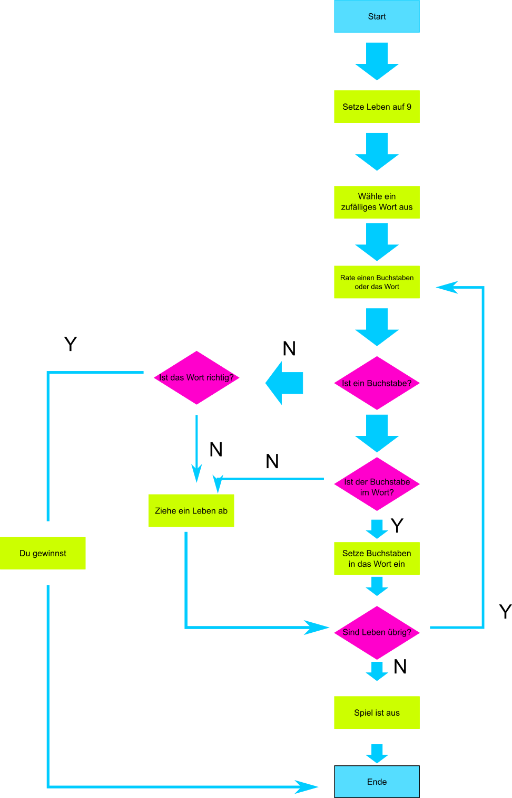

# Hang-Man

Machen wir uns zu Beginn erstmal einen Plan, wie das
Spiel ablaufen soll.



## Aufgabe
Für die ersten Schritte auf dem Weg zu unserem fertigen Programm muss folgendes umgesetzt werden:
+ **importierte** das Modul *random*
+ **erstelle** eine Variable *leben* der einen Wert von 9 zugewiesen wird
+ **erstelle**  eine Liste mit Wörtern, die alle fünf Buchstaben haben
+ **erstelle**  eine Variable mit dem Namen *geheim_wort*, der über die random.choice() Funktion ein zufälliges Wort aus der Liste zugewiesen wird
+ **erstelle**  eine Variable mit dem Namen *verdeckt_wort* und weise ihr die Liste *list("?????") zu
    >list("?????") verpackt die 5 Fragezeichen in eine Liste und hätte auch mit  ["?", "?", "?", "?", "?"] umgesetzt werden können
+ **erstelle**  eine Variabe mit dem Namen herz und weise ihr den Wert u'\u2764' zu
    >dabei handelt es sich um ein Unicode-Zeichen, also einer Menge an Zeichen, die jeder Computer kennt. Hierbei handelt es sich um das Zeichen für ein Herz.
+ **erstelle**  eine Variable mit dem Namen *wort_richtig_geragen* und ordne dieser den booleschen Wert *False* zu.

Als nächstes wollen wir uns eine Funktion *aktu_verdeckt()" definieren. Die Aufgabe dieser Funktion soll es sein, den von uns in die Konsole eingegebenen Buchstaben mit jedem Buchstaben des geheimen Wortes zu vergleichen und falls diese gleich sind, das "?" in unserer Liste mit diesem Buchstaben zu ersetzen.

```py
def aktu_verdeckt(buchstabe_geraten, geheim_wort, verdeckt_wort):
    index = 0
    while index < len(geheim_wort[index]):
        if buchstabe_geraten == geheim_wort[index]:
            verdeckt_wort[index] = buchstabe_geraten
        index = index + 1
```

**Kurze Erklärung zu der Funktion**:
+ die While-Schleife läuft den darunter liegenden Code so lange durch, bis das Ende von unserem geheimen Wort erreicht ist
+ ist der geratene Buchstabe gleich einem oder mehrerer Worte aus dem geheimen Wort, so wird das verdeckte Wort an der Stelle *index* (die "?" in unserer Liste) mit diesem Buchstaben ersetzt.
+ Wichtig: index = index +1 darf sich nicht in der if-Bedingung erfüllen, da wir den Zähler index immer dann um eins hochzählen wollen, wenn die while-Schleife einmal durchgelaufen ist und nicht, wenn die if-Bediungung erfüllt ist.

Kommen wir nun zum eigentlichen Programm-Durchlauf.

```py
while leben > 0:
    print(verdeckt_wort)
    print("Verbleibende Leben: "+ herz * leben)

    raten = input("Rate einen Buchstaben oder das Wort: ")

    if raten == geheim_wort:
        wort_richtig_geraten = True
        break

    if raten in geheim_wort:
        aktu_verdeckt(raten, geheim_wort, verdeckt_wort)

    else:
        print("Falsch. Ein Leben weniger")
        leben = leben - 1

if wort_richtig_geraten:
    print("Du hast gewonnen! Das Wort war " + geheim_wort)
else:
    print("Leider verloren! Das Wort war " + geheim_wort)
```

**Kurze Erklärung zu der Funktion**:
+ Solange die von uns gesetzten Leben nicht auf null gesetzt sind, soll das Programm ausgeführt werden
+ es wird das verdeckte Wort auf die Konsole geprintet, sowie die verbleibenden Leben. Ein schnellerer Syntex für die Anzahl der Herzen kann mit dem Befehl herz * leben umgesetzt werden
+ dann wird man aufgefordert, einen Buchstaben oder ein Wort einzugeben, dieses wird in der Variable raten eingespeichert.
+ falls das eingegebende Wort dem geheimen Wort entspricht, so wird die Variable *wort_richtig_geraten* auf true gesetzt. Mithilfe des Befehls *break* wird die while-Schleife beendet, auch dann, wenn wir eigentlich noch genug Leben hätten
+ falls es sich bei der Eingabe um einen Buchstaben gehandelt hat, überprüfen wir vorerst, ob sich der Buchstabe in unserem *geheim_wort* befindet. Ist dies der Fall, so wirt die Funktion *aktu_verdeckt* aufgerufen, die, wie wir bereits oben erfahren haben, das Fragezeichen an der richtigen Position mit unserem Buchstaben ersetzt
+ sollte der eingegebende Buchstabe oder das Wort jedoch falsch sein, so wird ausgegeben, dass die Eingabe falsch war und es wird ein Leben abgezogen
+ wurde die while-Schleife beendet (entweder keine Leben mehr oder die Schleife wurde durch die richtige Eingabe des gesuchten Wortes vorzeitig beendet), so wir mithilfe einer if-Bediungun überprüft, ob die Variable *wort_richtig_geraten* auf true gesetzt worden ist. Ist dies der Fall, so hat man gewonnen, ansonsen hat man verloren.

<br>
<br>

| Tables   |      Are      |  Cool |
|----------|:-------------:|------:|
| col 1 is |  left-aligned | $1600 |
| col 2 is |    centered   |   $12 |
| col 3 is | right-aligned |    $1 |
    
$-\frac{p}{2} \pm \sqrt{\frac{p^2}{4}-q}$