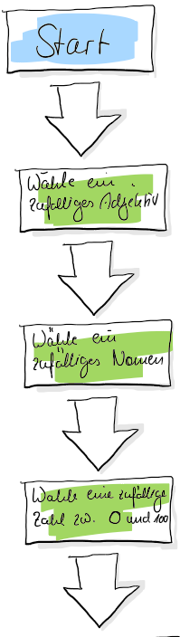
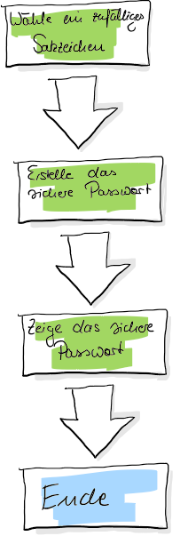

Das Programm, mit dem wir uns heute beschäftigen, hat den folgenden Aufbau, dargestellt in einem FlowChart:





Zu Beginn soll das Programm eine zufälliges Adjektiv, ein zufälliges Nomen, eine zufällige Zahl zwischen 0 und 100 und ein zufälliges Satzzeichen wählen. Dafür hilft uns das random-Modul (Erklärung folgt später). Damit das Programm weiß, welche Adjektive, Nomen etc. zur Verfügung stehen, legen wir eine Liste an. Dabei handelt es sich um eine neue Art, Daten in einem Programm zu strukturieren.

# Schritt 1: Start
Zu Beginn wird werden die nötigen Module importiert, die wir für die weitere Arbeit brauchen. Wir erstellen also ein neues Programm und tragen in den ersten Zeilen unseres Programms folgendes ein:

```python 
import random
import string
```

Hierbei handelt es sich um sogenannte Module, welche man sich als Pakete vorstellen kann. 

## Aufgabe
1) Überlege dir, welche Vorteile es haben könnte, Programm-Code in Pakete aufzuteilen, die nach belieben importiert werden können.

Nachdem die Module importiert worden sind, wollen wir erstmal den Benutzer begrüßen.

## Aufgabe 
1) Schreibe ein oder mehrere Zeilen Code, mit der/ denen der Benutzer/ die Benutzerin begrüßt wird und weiß, um welches Programm es sich handelt. Nutze hierfür den print-Befehl, den du bereits kennst.


# Schritt 2: Wähle ein zufälliges Adjektiv
Nun wollen wir ein zufälliges Adjektiv aus einer Liste bestehend aus Adjektiven auswählen. Dafür überlegen wir uns zuerst den Namen der Variable, in der wir die Liste ablegen wollen. *die_adjektive* bietet sich hierfür doch gut an. Wir ergänzen unseren Code um folgende Zeilen:
```python
import random
import string

die_adjektive = ['schläfrig', 'lahm', 'stinkend'] #füge noch weitere Adjektive hinzu

# Hier der Code für die Begrüßung des Users
```
***Wichtig:*** Damit Python erkennt, dass es sich um die Datenstruktur einer Liste handelt, benutzen wir die *eckigen Klammern []*, gefolgt von dem Inhalt, den *Elementen*. Listen können dabei aus verschiedenen *Elementen* bestehen und müssen nicht, wie in unserem Fall, aus Wörter bestehen. So wäre beispielsweise

```python
die_zahlen = [1,6,3]
```
auch denkbar.

## Aufgabe
1) Erstelle ebenfalls auf die gleiche Art und Weise eine Liste für Nomen. Lege die Liste beispielsweise in eine Variable mit dem Namen *die_nomen* ab.

# Schritt 3: Wörter, Zahlen und Punktationen auswählen
Doch wie wählt man nun die Wörter aus den Listen aus? Zum Glück haben wir das zu Beginn unseres Codes eingefügte random-Modul. Das random-Modul wird von Python zur Verfügung gestellt und bietet uns Funktionen, mit denen wir aus einer Python Liste zufällig Elemente auswählen können. Also genau das, was wir jetzt auch brauchen! Um dies umzusetzen, benutzen wird die Funktion choice des random-Moduls. Die Funktion choice liefert uns ein Element aus einer Liste zurück, dass wiederum in einer Variable abgespeichert werden muss. Wir schreiben:

```python
import random
import string

die_adjektive = ['schläfrig', 'lahm', 'stinkend'] #füge noch weitere Adjektive hinzu

# weitere Liste für die Nomen

# Hier der Code für die Begrüßung des Users

# Wählt aus der Liste die_adjektive ein zufälliges Wort aus und speichert das Wort in der Variable adjektive.
adjektive = random.choice(die_adjektive) 

# Wählt aus der Liste die_nomen ein zufälliges Wort aus und speichert das Wort in der Variable nomen.
nomen = random.choice(die_nomen)
```

Nach unserem obigen Flow-Chart brauchen wir nun aber auch noch eine Zahl und ein Satzzeichen. Natürlich könnte man nun auch eine Liste verschiedener Zahlen und Punktation-Zeichen wie ".,:!" anlegen; wir machen es uns jedoch einfacher.

So bietet das random-Modul auch die Möglichkeit, mithilfe der Funktion randrange(to, until) uns eine zufällige Zahl innerhalb der gesetzten Grenzen auszugeben. 


***Wichtig***: Die hintere Zahl ist *excluded*, was in der Programmiersprache soviel bedeutet wie, dass diese Zahl nicht mehr im innerhalb der Grenzen ist. Beispiel: Die Zeile 
```python
zahl = random.randrange(0, 20)
```
gibt uns eine zufällige Zahl zwischen 0 und 19 aus. Die 20 ist nicht mehr mit inbegriffen. Wollen wir auch die Möglichkeit mitnehmen, dass die 20 erscheint, so müssen wir die Funktion anpassen und 
```python
zahl = random.randrange(0, 21)
```
schreiben.

Und wie bekommen wir an die verschiedenen Satzzeichen? Mithilfe des string-Modules!

## Aufgabe
Lass dir in der python IDLE mithilfe des print-Befehls folgendes ausgeben:
```python
print(string.punctation)
```

Hierbei handelt es sich um eine Konstante. Eine Konstante ist eine besondere Variable mit unveränderlichem Inhalt. Die Konstante ***string.punctation*** enthält einen String aus lauter Satzzeichen. 

Und damit sind wir fertig... fast! Denn wir müssen die einzelnen Elemente, die wir aus den jeweiligen Listen herausgezogen haben, in einem String noch zusammensetzen und uns auf dem Bildschirm anzeigen lassen. Gut, dass du von den vergangenen Lektionen schon weißt, wie man Strings zusammensetzt.

## Aufgabe
1) Setze die einzelenen Elemente zu einem String zusammen. Gib diesen String anschließend mit einem print-Befehl aus. Solltest du nicht weiter kommen, findest du im LessonScripts Ordner die Lösung.


