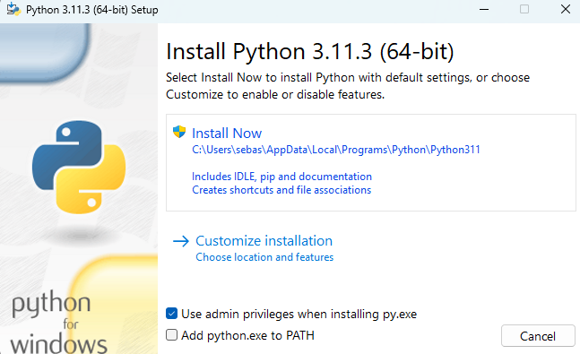
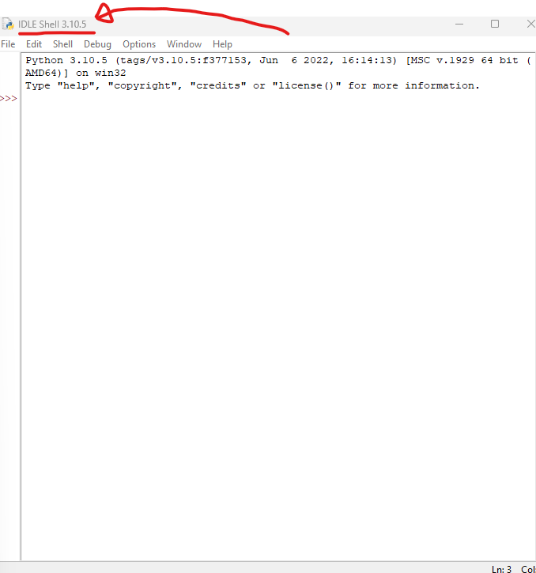

# Wie richte ich Python auf meinem Computer ein?

1) Gehe in einem Internetbrowser deiner Wahl auf die Seite: https://www.python.org/

2) Die Seite, die du im Browser aufrufst, sollte so aussehen:

Hier findest du unter anderem den Reiter "Download". Dort kannst du dir die Datei für Windows als auch für Mac herunterladen. 

3) Nachdem das Installationsprogramm heruntergeladen worden ist, starte es:

Installiere das Programm wie empfohlen. Nach der Installation kannst du das Fenster schließen.

4) Gib anschließend in der Windows Suchleiste (oder auf dem Mac in der Suchleise) python ein. Es sollte sich eine Datei mit dem Namenn __IDLE Schell__ oder __IDE...__ finden lassen. Führe es darauf aus. Es sollte sich das folgende Fenster öffnen:
 

 Du hast Python erfolgreich auf deinen PC installiert.